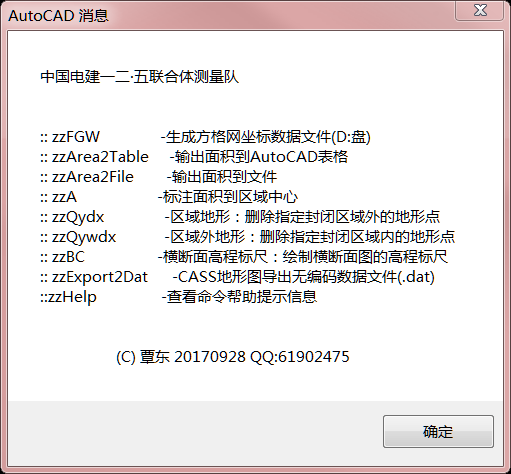

# AutoCAD工程测量工具集（Construction-Surveying-Toolkit-For-AutoCAD）

声明：本程序中部分代码采用了网上收集的代码，在此基础上作了部分修改。拷贝请勿删除源码中的声明内容。
主文件为：zzACAD16ToolBox.lsp，zzACAD16ToolBox.vlx为其编译版。其它源码文件为测试时使用，完成后均已加入其中。
所有工具均以“ZZ”开头，在加载后在命令行中输入“ZZ”后会以列表形式显示出所有相关内容，按上、下键在列表中可以快速选择执行。

## 面积标注
面积标注主要分为以下三种：
### 图面面积标注
### 表格面积标注
### 文件面积保存

